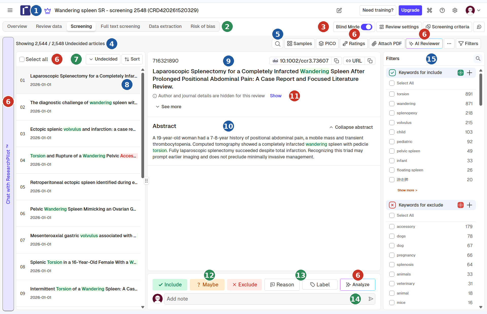

# 儿童游走脾系统综述：筛选操作手册
一步一步完成标题摘要筛选、分歧处理和全文筛选

<!-- kv; widths: 17,83 -->
| 版本 | 操作手册 v2026-10-10b（草稿）。标 **【建议】** 的内容需要三位确认后才算生效 |
| 项目 | 儿童游走脾系统综述（含个体患者数据）和单中心病例系列；PROSPERO CRD420261520329；协议 v1.3 |
| 适用对象 | 舒俊（筛选员 1，Rayyan 项目所有者）、彭飞（筛选员 2）、杨军（仲裁）。Claude 负责整理数据、运行脚本和起草文件，不对任何一条记录做筛选决定 |
| 配套文件 | 《筛选指南》v2026-10-10b：判断规则以它为准。分歧清单脚本：`tools/screening_conflicts.py` |
| 要筛的记录 | 2,548 条（编号 WS0001–WS2548）；628 条没有摘要；716 条是中文记录 |
| Rayyan 项目 | 正式项目 **Wandering spleen SR - screening 2548 (CRD420261520329)**。另有一个 calibration 50 项目，已经用完，不要再在里面筛 |

:::tip 怎么用这份手册
- 《筛选指南》回答"这条记录该选什么"；本手册回答"具体怎么做"：先做什么、点哪里、出了问题怎么办、筛完怎么收尾。两者不一致时，以指南为准。
- 标 **【建议】** 的是本手册新增的操作建议，不改变任何判断规则；标 **【待核实】** 的是 Claude 没有在 Rayyan 里亲眼看过的细节，请按你们的实际界面确认，再告诉 Claude 更新。
- 附录 F 把所有【建议】和【待核实】列成了清单。
:::

## 内容一览

<!-- widths: 9,63,28 -->
| 章 | 内容 | 谁需要读 |
| 1 | 整个筛选怎么走（一页纸） | 所有人 |
| 2 | 要筛什么：数据、纳入标准、三种决定的含义 | 所有人 |
| 3 | 开始前的准备清单；哪些按钮不要点 | 舒俊、彭飞 |
| 4 | 认识 Screening 页面（带标注的截图） | 舒俊、彭飞 |
| 5 | 每次筛选的流程和节奏 | 舒俊、彭飞 |
| 6 | 逐条筛选：怎么判断（五个问题、速查表、练习） | 舒俊、彭飞 |
| 7 | 在 Rayyan 里点哪里 | 舒俊、彭飞 |
| 8 | 出了问题怎么办；常见问题 | 舒俊、彭飞 |
| 9 | 工作量和进度 | 所有人 |
| 10 | 筛完之后：记数、关盲法、导出、讨论、仲裁 | 所有人；杨军重点看 10.7 |
| 11 | 全文筛选 | 舒俊、彭飞 |
| 12 | 要记录和报告的数字 | 舒俊、Claude |
| 附录 | A 速查卡　B 筛选记录表　C 筛完记数表　D 术语对照　E 脚本命令和输出文件　F 建议和待核实清单　G 依据 | |

\pagebreak

## 1. 先看这一页：整个筛选怎么走

两位筛选员各自独立把 2,548 条记录筛一遍，互相看不到对方的决定。筛完之后才对照：两人一致的直接定下来，只有"一人排除、另一人不排除"的记录才需要讨论，讨论不了的交杨军仲裁。

<!-- widths: 7,19,40,34 -->
| 步骤 | 谁 | 做什么 | 做完的标志 |
| 1 | 舒俊、彭飞 | 对照第 3 章清单核对 Rayyan 设置 | 清单全部打勾 |
| 2 | 舒俊、彭飞（各自独立） | 2,548 条逐条选 Include / Maybe / Exclude（第 6、7 章） | 各自顶部显示 "Showing 0 / 2,548 Undecided" |
| 3 | 舒俊、彭飞 | 关盲法之前，各自记下自己的数字（附录 C） | 记数表填完 |
| 4 | 舒俊（项目所有者） | 只在正式项目里关 Blind Mode，导出 CSV（10.3–10.4） | 得到 articles.csv 和 customizations_log.csv |
| 5 | Claude | 把两个文件交给脚本，生成分歧清单和汇总（10.5） | 得到分歧清单 |
| 6 | 舒俊、彭飞 | 讨论"一人排除、另一人不排除"的记录（10.6） | 能一致的已填好 discussion_agreed_decision |
| 7 | 杨军 | 对讨论不一致的记录仲裁（10.7） | 已填好 adjudicator_decision |
| 8 | Claude | 合并出"进入全文的记录"清单（10.8） | 舒俊、彭飞核对条数 |
| 9 | 舒俊、彭飞（各自独立） | 获取全文，逐篇判断（第 11 章） | 全文阶段分歧解决 |
| 10 | 舒俊、Claude | 汇总 PRISMA 数字、kappa，写方法部分（第 12 章） | 数字表填完 |

:::rule 三条底线
1. **独立。** Blind Mode 一直开着；筛完之前不看对方的决定，不讨论具体记录，不把屏幕给对方看。
2. **拿不准就选 Maybe。** Maybe 的代价只是多读一篇全文；一个错误的 Exclude 会让一篇文章永远消失（两人都 Exclude 的记录不会再被复核）。
3. **每个 Exclude 都要有 E 理由。** 说不出是 E1–E6 里的哪一条，就不要 Exclude，改选 Maybe。
:::

## 2. 要筛什么

### 2.1 记录和数据
- 文件：`search/dedup/records_deduplicated.ris`，**2,548 条**，每条有唯一编号 **WS0001–WS2548**。检索共识别 4,906 条，去重（脚本，EndNote 核对）后剩 2,548 条。
- 其中 628 条没有摘要（24.6%），716 条是中文记录（28.1%）。类型：期刊文章 2,430、专利 50、通用类型 21、书籍章节 20、会议 14、学位论文 10、报纸 3。年份从 1880 年代到 2026 年。
- 检索了六个数据库：PubMed、Web of Science、Scopus、CNKI、万方、CBM。Embase、Google Scholar 没有检索，引文追溯没有完成，这些在方法部分作为局限写明，和筛选操作无关。
- 校准用的 50 条（从这 2,548 条里随机抽的）在正式项目里照样重筛一遍。预试用的 53 篇文献也在这 2,548 条里，和其他记录一样重新筛，不需要特殊处理（指南第 8 节）。
- **WS 编号怎么看：** 舒俊确认记录里能看到 WS 编号（具体位置没有截图，可能在 See more 里）。如果只看得到记录上方那串 9 位数的 Rayyan 编号，**WS 编号 = Rayyan 编号 − 716321889**（用两条记录核对过：716321890 = WS0001，716323779 = WS1890；只适用于正式项目）。向别人说某条记录时，用 WS 编号。**【待核实】**

### 2.2 什么样的报告要纳入（协议和指南）
- **疾病：** 游走脾（位置异常、可移动的脾），伴或不伴脾蒂扭转。先天性和获得性（如胃底折叠术、肾切除术后）都符合，获得性病例之后作为亚组分析。
- **人群：** 年龄小于 18 岁（以手术时为准；没做手术的以诊断时为准）。
- **文章类型：** 病例报告、病例系列、队列研究，以及描述了原始患者的信件和综述。
- **个体数据：** 摘要里看不出来时，不要因此排除，留给全文阶段判断。

### 2.3 要排除的（协议和指南）
- 副脾（accessory / supernumerary spleen）扭转，包括游走的副脾。
- 位置正常的脾脏扭转（没有异位）；脾种植（splenosis）；脾异位妊娠；脾移植。
- 动物、兽医和实验研究。
- 年龄没有逐例报告、又无法确定小于 18 岁的患者。
- 没有新病例的综述（只用来查参考文献）、没有患者的社论和评论、会议摘要、专利、报纸。

### 2.4 三种决定的含义
<!-- widths: 14,50,36 -->
| 决定 | 什么时候选 | 之后会怎样 |
| **Include** | 标题或摘要已经明确符合：是游走脾、患者是儿童、是病例类文章 | 进入全文阶段 |
| **Maybe** | 不能确定，或信息不足：没有摘要、年龄没写、"脾扭转"没说脾脏位置、成人与儿童混合…… | 进入全文阶段 |
| **Exclude** | 明确不符合，而且你能说出是 E1–E6 里的哪一条 | 两人都 Exclude：不再复核。一人 Exclude、另一人不是：进入讨论和仲裁 |

Include 和 Maybe 都进入全文，所以两人一个选 Include、一个选 Maybe 不算需要解决的分歧，只在报告里写条数（指南第 7 节）。

### 2.5 为什么是两个人、为什么要盲法
- 协议第 14 节规定：两位筛选员独立筛选标题和摘要，再独立筛选全文；分歧由讨论解决，必要时由第三位（杨军）决定。
- 协议 v1.3 写明：Rayyan 的盲法在两人都筛完一个阶段之前保持开启，作者和期刊信息隐藏。这样"独立"才真正做得到、也能被证明：盲法开着，两人在筛完之前看不到对方的决定，方法部分才能写"独立筛选"。
- 标题摘要阶段的一致性（Cohen's kappa）会在论文里报告。校准的 50 条：一致 45/50（90.0%），kappa 0.83。

## 3. 开始前的准备清单

这些设置 10 月 7 日已经核对过一遍；每个人在自己的电脑上再对照一次。

### 3.1 账号和项目
- [ ] 用**自己的** Rayyan 账号登录（舒俊和彭飞各用各的，不共用账号）。
- [ ] 打开项目 **Wandering spleen SR - screening 2548 (CRD420261520329)**：标题里要有 "screening 2548"。不要在 "calibration 50" 项目里筛。
- [ ] 点顶部标签 **Screening**。

### 3.2 浏览器
- [ ] 对 rayyan.ai **关闭浏览器的自动翻译**（地址栏里一般有翻译图标，选"不翻译此网站"），并关掉会自动翻译网页的插件。
- [ ] 确认按钮和摘要都是英文（Include / Maybe / Exclude……）。

:::warn 为什么要关翻译
机器翻译会改变医学术语，也可能让 Rayyan 的按钮失灵（Embase 页面就因为自动翻译报过错误）。两位筛选员都读原文，结果才可比。中文记录本来就是中文，不受影响。
:::

### 3.3 项目设置核对
- [ ] **Blind Mode** 开关是开着的（Screening 页右上角，蓝色）。
- [ ] 每条记录标题下面写着 **Author and journal details are hidden for this review**（作者和期刊隐藏）。不要点旁边的 Show。
- [ ] 右侧 Filters 面板里，**Keywords for include / Keywords for exclude** 两个列表与 10 月 7 日核对过的一致（include 19 个词，exclude 47 个词）。这两个列表是项目共享的，**不要自己增删**。
- [ ] 点 Exclude 弹出的理由窗口里，能看到 **E1–E4**（E5、E6 和两个标签在第一次需要时创建，见 3.5）。
- [ ] 左侧列表过滤器选 **Undecided**，顶部显示 "Showing N / 2,548 Undecided articles"。

### 3.4 哪些按钮不要点
<!-- widths: 30,70 -->
| 按钮或位置 | 为什么不要点 |
| Blind Mode 开关 | 只有项目所有者在两人都筛完、都记完数之后才关。误关会让你看到对方的决定，独立性就没了 |
| Show（作者和期刊） | 校准时作者和期刊对两人都曾可见，已经是方法部分要写的局限。正式筛选不要再出现这种情况 |
| Review data 标签 | 列表直接显示作者和年份，不受"隐藏"设置约束。筛选时不要打开，只在导出时用 |
| AI Reviewer、Analyze、Chat with ResearchPilot | 协议 v1.3 写明不使用 Rayyan 的人工智能功能、自动查重和自动处理重复；要用必须先改协议并在方法里说明 |
| Ratings、按 Rating 排序 | 据 Claude 所知，Rayyan 会根据你已有的决定给其余记录打相关性预测分。这很可能属于协议 v1.3 所说的"人工智能功能"（协议没有单独点名 Ratings）；顺序不影响结果，保持默认顺序即可 **【建议】** |
| PICO、Samples | 和这次筛选无关 |
| Select all 和多选批量操作 | 一次误点会把成批记录改成同一个决定 |
| Detect duplicates、Auto resolve | 去重已经由脚本和 EndNote 做完。Rayyan 的查重会把标题通用的记录（如 "Wandering spleen."）误判为重复 |
| Filters 里的 + 和垃圾桶（增删高亮关键词） | 列表是项目共享的，增删会改变对方的页面。要改先三人商量，由所有者改，并更新指南 |
| Screening criteria | Claude 没有打开过，不清楚它的作用。不需要，不要在里面填内容 |
| 删除记录 | 任何记录都不删除；"重复""不相关"一律用 Exclude 或备注处理 |

### 3.5 E5、E6 和两个标签：第一次需要时创建
我们没有找到可以预先设置排除理由和标签的地方（Review settings 里没有；Screening criteria 没有打开看过）。实际做法是：在对一条记录操作时输入新名称来创建，创建后保存在项目的列表里，另一位筛选员从列表里选。**所以创建本身就是对那条记录做了一次真实的决定。** 因此：

- 只在**真正符合**的记录上创建：`E5 not a formal article` 用在专利、报纸、会议摘要、产品说明上；`E6 other` 只在真有"其他"理由、并且写得出一句具体说明时；`review-for-refs` 只用在没有新病例的综述上；`lang-other` 只用在英文、中文以外语言的相关文章上。
- 名称必须**一字不差**（大小写、空格都一样）：`E5 not a formal article`、`E6 other`、`review-for-refs`、`lang-other`。
- 谁先遇到谁创建；第二个人从列表里选，**不要再输一遍同名**，否则会出现两个只差一个空格的版本。
- 创建后打开那条记录确认：理由显示为红色标签、和 Excluded 同时出现；标签是另一种颜色。Label 和 Reason 两个按钮挨着，容易点错。
- 创建时做的决定是真实决定。另一位筛选员遇到同一条记录时照常独立判断，创建的人不要事先告诉对方自己选了什么。
- 截至 10 月 10 日，E5、E6 和两个标签都还没有创建。没有遇到合适的记录就不用创建，等遇到时再建。

## 4. 认识 Screening 页面


> 图 1　Screening 页面（正式项目，Blind Mode 开着，第 01 条记录打开）。绿色编号 = 筛选时要用；蓝色 = 只看；红色 = 不要点。

<!-- widths: 6,22,30,42 -->
| 编号 | 位置 | 是什么 | 筛选时怎么用 |
| 1 | 页面顶部 | 项目名称 | 每次开始前看一眼，确认是 screening 2548 |
| 2 | 标签栏 | Overview / Review data / Screening / Full text screening / Data extraction / Risk of bias | 标题摘要阶段只用 **Screening**；Review data 只在导出时用 |
| 3 | 右上角蓝色开关 | Blind Mode | 保持开启，不要点 |
| 4 | 列表上方的文字 | 进度：Showing N / 2,548 Undecided articles | N 是你还没决定的条数；已决定 = 2,548 − N，筛完时 N = 0 |
| 5 | 工具栏的放大镜 | 搜索记录 | 筛选用不到；只在要找某一条记录时用（中文搜索不可靠，见 8.1） |
| 6 | Samples、PICO、Ratings、AI Reviewer、Analyze 按钮、左侧 Chat with ResearchPilot、Select all | 辅助功能、AI 功能、批量选择 | 不用 |
| 7 | 列表顶部 | Undecided 过滤器和 Sort 排序 | 过滤器保持 **Undecided**；排序保持默认 |
| 8 | 左侧记录列表 | 每条显示序号、标题、日期；绿色词是 include 关键词，红色词是 exclude 关键词 | 做完决定的记录会从 Undecided 列表里消失（决定了 4 条时显示 2,544 / 2,548） |
| 9 | 记录上方 | 数字是 Rayyan 编号；doi 和 URL 按钮 | WS 编号 = Rayyan 编号 − 716321889。doi 和 URL 按钮会跳到网页，筛选时不需要点 |
| 10 | 标题和摘要 | 判断的依据 | 绿色词可能相关，红色词可能要排除；高亮只是辅助（见 6.3） |
| 11 | 标题下一行 | Author and journal details are hidden for this review，旁边有 Show | 保持隐藏，不要点 Show |
| 12 | 底部三个彩色按钮 | **Include / Maybe / Exclude** | 做决定 |
| 13 | Reason、Label | 排除理由、标签 | Exclude 时用 Reason 选 E1–E6；Label 只用两个标签 |
| 14 | 按钮下方的输入框 | Add note（备注） | 见 7.4 |
| 15 | 右侧 Filters 面板 | Keywords for include / exclude，每个词后面是命中条数 | 只看，不改 |

## 5. 每次筛选的流程和节奏

### 5.1 开始前的 2 分钟检查
- [ ] 浏览器对 rayyan.ai 的自动翻译是关闭的
- [ ] 项目是 screening 2548，标签是 Screening
- [ ] Blind Mode 开着
- [ ] "Author and journal details are hidden…" 那行还在。**如果作者和期刊显示出来了：先不要筛**，记下日期和时间，告诉其他人（指南第 3 节）
- [ ] 过滤器是 Undecided；把顶部 "Showing N / 2,548" 里的 N 记在筛选记录表里（附录 B）

### 5.2 筛选中
- 按第 6 章逐条判断，按第 7 章点按钮。
- **只看标题和摘要。** 没有摘要就只看标题（指南 4.3）；不要为了某条记录去网上查摘要或全文，否则两人看到的信息就不一样了 **【建议】**。
- 不和对方讨论具体记录，也不给对方发截图（截图里有你的决定）。
- 遇到指南没写清楚的情形：**先选 Maybe**，把 WS 编号和你的做法记下来（附录 B 的备注栏即可），攒一批后告诉 Claude。Claude 整理成问题清单，由三位商定要不要、怎么写进指南；写进去以后，两位各自读更新后的指南，不直接互相讨论 **【建议】**。

### 5.3 结束时
- 把顶部的 N 再记一次，算出这次完成了多少条，填进附录 B。
- 离开前把打开的窗口关掉（例如 Exclude with Reasons 窗口：点 × 或 Cancel，**不要点 Apply**）。
- 不需要点"保存"：每次点击决定，Rayyan 都会记下一条带时间的事件（校准导出的日志里每个决定都有时间戳）。

### 5.4 节奏 **【建议】**
- 每次连续筛 45–60 分钟，休息 5–10 分钟。疲劳会增加错误；这是通用做法，不是本项目的数据。
- 校准时的速度大约每小时 150–300 条（见第 9 章）。不必追求数量：一个错误的 Exclude 比慢更贵。
- 两人不需要同时筛，各自安排时间。

## 6. 逐条筛选：怎么判断

### 6.1 三个原则
1. **拿不准选 Maybe。** 两种错误的代价不一样：错选 Maybe 只多读一篇全文；错选 Exclude（而且另一人也 Exclude）这篇文章就丢了。
2. **Exclude 必须说得出 E 理由。** 校准里 4 条没选理由的 Exclude，最后全成了分歧；按指南，这类记录现在应该选 Maybe。
3. **只依据标题和摘要。** 摘要里看不出来的事（有没有个体数据、年龄），不要猜，留给全文。

### 6.2 对每条记录依次问五个问题
<!-- widths: 22,31,27,20 -->
| 问题 | 明确"否"：Exclude 并选理由 | 看不出或不确定 | 明确"是" |
| 1 这是人类患者的研究吗？ | 动物、兽医、实验 → **E1** | （很少见）继续往下问 | 继续 |
| 2 讲的是游走脾吗？（位置异常或可移动的脾，含 floating spleen、pelvic spleen、脾下垂；伴或不伴扭转） | 脾种植、副脾（含游走的副脾）、位置正常的脾扭转、脾异位妊娠、脾移植、保脾手术或脾切除技术而游走脾不是适应证 → **E2** | "脾扭转"没说位置、"异位脾"没进一步描述、游走脾和副脾同时描述 → **Maybe** | 继续 |
| 3 患者可能是 18 岁以下吗？ | 明确全部是成人 → **E3** | 年龄没写、只写"病人"、成人和儿童混合 → **Maybe** | 继续 |
| 4 有原始患者（新病例）吗？ | 无新病例的综述、社论、评论、只评论他人文章的信件 → **E4**（综述同时加标签 `review-for-refs`） | 摘要看不出有没有个体数据 → **不要因此排除**，留给全文 | 继续 |
| 5 是正式文章吗？ | 会议摘要（只有摘要）、专利、报纸、产品说明 → **E5** | 看起来是完整论文的中文会议论文、含临床病例资料的学位论文 → **Maybe** | 继续 |

:::rule 从五个问题得出决定
- **任何一个问题明确"否"** → **Exclude**，选对应的 E 理由。几个理由都适用时，选任何一个适用的都可以，不用为此讨论。
- **问题 1–3 都明确"是"，4 和 5 没有明确"否"** → **Include**。
- **其余情况**（任何一个"看不出"）→ **Maybe**。
- **没有摘要的记录永远不选 Include**，见 6.4。
- 不属于上面任何一类、但你确信应该排除 → E6，并写一句具体说明；写不出就选 Maybe。
:::

### 6.3 先看什么，后看什么
1. **标题：** 先找有没有明显的非人类、非游走脾、非正式文章的词（dog、canine、splenosis、accessory、patent、专利、蜂箱……）。
2. **摘要里找年龄：** 几岁、infant、child、pediatric、adolescent、成人、孕妇……
3. **摘要里找脾脏的位置和描述：** wandering、floating、pelvic、ectopic、游走、漂浮、盆腔、异位、脾蒂扭转。
4. **摘要里找"我们报告了……一例或几例"**（新病例），还是"我们综述了……篇文献"。
5. **年龄的几个边界：** 小于 18 岁才算儿童；"young adult""teenager"没有数字时选 Maybe；年龄范围跨过 18 岁（如 0–40 岁）是成人儿童混合，选 Maybe；孕妇一般是成人（指南 4.3 把妊娠期孕妇当作"明确是成人"的例子），但摘要写了年龄而且小于 18 岁的，以年龄为准。

:::tip 关于高亮
绿色词（wandering、torsion、child……）和红色词（accessory、dog、splenosis……）可以帮你快速定位，但只是辅助。Rayyan 的高亮按**整词**匹配：`child` 不会标出 children。**中文词更不完整**：只有词的两侧是标点或空格时才会标出，夹在其他汉字中间的不会标（2,548 条里标题或摘要含"游走脾"的有 162 条，Rayyan 只标了 20 条）。所以中文记录没有高亮，不代表不相关。
:::

### 6.4 没有摘要的记录（628 条）
- **只看标题，只用 Maybe 或 Exclude，不用 Include。**
- 标题**明确**符合某条 E 理由（标题写明是动物、全部成人、副脾、脾种植、专利……）才 Exclude，并选对应理由。
- 说不出是哪一条理由的，一律 **Maybe**，留待全文。
- 老文献、看起来像成人或像其他科室的标题，只要标题里有游走脾、浮动脾、脾扭转等词、又没有明确的排除理由，也选 **Maybe**。

:::warn 校准里的教训
5 条分歧全部出在没有摘要的记录上（11 条没有摘要的记录里 5 条分歧，39 条有摘要的记录 0 条分歧）。其中 4 条是一人选 Maybe、另一人选 Exclude，而那 4 条 Exclude 都没有选排除理由。指南据此规定：没有摘要时，说不出 E 理由就选 Maybe。
:::

### 6.5 常见情形速查（来自指南 4.3 节）
下表由指南 4.3 节自动生成；指南改动后，本手册要重新生成。

<!-- widths: 58,42 -->
@@GUIDE_TABLE 4.3 常见情形速查@@

### 6.6 中文记录的要点
- 游走脾、游动脾、漂浮脾、脾下垂 = wandering / floating spleen / splenoptosis，**符合**。
- 脾蒂扭转、脾扭转：要判断是游走脾所致还是别的原因，拿不准选 Maybe。
- 异位脾：可能是游走脾，也可能是副脾或脾种植，选 Maybe。
- 脾种植、异位脾种植 = splenosis，排除（E2）。副脾 = accessory spleen，排除（E2），除非同时描述游走脾（Maybe）。
- 脾异位妊娠 = 妊娠着床在脾，排除（E2）。移植脾 = transplanted spleen，排除（E2）。
- 中文数据库里还有一类专利（蜂箱、摇蜜机之类；检索命中只是因为"巢脾"里有个"脾"字），是 E5，容易辨认。
- 两位筛选员都读中文原文，不使用机器翻译。

### 6.7 练习：12 个示意标题怎么选
下面是**自拟的示意标题**，用来演示怎么套用规则，不是数据集里的记录。

<!-- widths: 28,29,19,24 -->
| 示意标题 | 摘要里有什么 | 选什么 | 为什么 |
| Wandering spleen with torsion in a 6-year-old girl: a case report | 6 岁女孩，CT 示游走脾伴脾蒂扭转，行脾切除 | **Include** | 人类、游走脾、儿童、新病例都明确 |
| Torsion of a wandering spleen in a 34-year-old woman | 34 岁女性 | **Exclude：E3** | 全部是成人 |
| Splenic torsion: a rare cause of acute abdomen | 一例脾扭转，没有年龄，没提脾脏位置 | **Maybe** | 年龄和位置都看不出，留给全文 |
| Torsion of an accessory spleen in a child | 9 岁男孩的副脾扭转 | **Exclude：E2** | 协议明确排除副脾扭转，虽然是儿童 |
| Abdominal splenosis mimicking a pelvic mass | 外伤脾切除后的脾种植 | **Exclude：E2** | 脾种植不是游走脾 |
| Gastric volvulus associated with a wandering spleen in an infant | 婴儿，胃扭转合并游走脾 | **Include** | 胃扭转合并游走脾归亚组，单独分析 |
| Splenic torsion in dogs: 12 cases | 犬 | **Exclude：E1** | 非人类 |
| Wandering spleen: a review of the literature | 综述 40 篇文献，没有新病例 | **Exclude：E4**，加标签 `review-for-refs` | 没有原始患者数据，保留参考文献 |
| Wandering spleen in a child: case report and literature review | 报告自己的一例，并综述文献 | **Include** | 综述但含新病例 |
| [Torsion of the spleen]（1962 年，没有摘要） | 无 | **Maybe** | 没有摘要不能 Include；标题没有明确的排除理由 |
| Re: Wandering spleen in children（信件） | 只评论别人的文章，没有患者 | **Exclude：E4** | 没有原始患者数据 |
| 一种脾脏固定装置（专利） | 专利摘要 | **Exclude：E5** | 专利不是正式文章 |

### 6.8 拿不准的时候
- 想 Exclude 时先问自己：**我能说出是 E1–E6 里的哪一条吗？** 说不出，选 Maybe。
- 在 Include 和 Maybe 之间拿不准，选 **Maybe**：两者都进入全文，差别只在报告里写条数，不需要仲裁。
- 可以在 Add note 里写一句"不确定的原因"（可选，对全文阶段有用）。备注只写事实，不写对对方的猜测。
- 把你觉得指南没写清楚的情形记下来（WS 编号 + 你的做法），见 5.2。

## 7. 在 Rayyan 里点哪里

### 7.1 Include 和 Maybe
1. 在左侧列表里点一条记录，右边会显示它的标题和摘要（用 Undecided 过滤时，列表最上面一条就是下一条要筛的）。
2. 读完标题和摘要（第 6 章）。
3. 点底部的 **Include**（绿色）或 **Maybe**（黄色）。
4. 这条记录从 Undecided 列表里消失，顶部的 N 减 1。点下一条。

Include 和 Maybe **不需要选理由**；如果误选了排除理由，要去掉（7.6）。

### 7.2 Exclude 并选理由
1. 先按第 6 章确定理由。
2. 点底部的 **Exclude**（红色）。
3. 在理由窗口里（**Exclude with Reasons**，或点 **Reason** 打开）勾选**一个**你确定的理由：`E1 non-human`、`E2 not wandering spleen`、`E3 adults only`、`E4 no original patient data`、`E5 not a formal article`、`E6 other`。
4. 点 **Apply**。
5. 检查：记录上同时有 **Excluded** 和一个红色的、以 E 加数字开头的理由。

:::warn 不要勾 Rayyan 自带的理由
理由窗口里有 Rayyan 自带的一批理由（background article、foreign language、wrong drug、wrong outcome、wrong population、wrong publication type、wrong study design 等）。这些是为干预研究设计的，和 E1–E6 不对应：两人一个用默认理由、一个用 E1–E6，理由就没法比较，也进不了 PRISMA 图。**只选 E1–E6。**
:::

:::verify 待核实
理由窗口怎么打开（点 Exclude 后自动弹出，还是要再点 Reason）、怎么勾选已有的理由，Claude 没有亲眼看过完整过程。以你们校准和建 E1–E4 时的实际操作为准，关键是第 5 步的结果。窗口里每个理由旁边有 **Click to add hotkey**，可以给 E1–E6 设快捷键来提速（可选；快捷键是个人设置还是项目共享、会不会误触，都没有验证）。
:::

### 7.3 创建 E5、E6（第一次遇到时）
1. 找到一条真正符合的记录（例如一条专利）。
2. 点 **Exclude**，在理由窗口底部的 **Add exclusion reasons** 框里输入名称，如 `E5 not a formal article`，点 **Apply**。（E1–E4 就是这样创建的。）
3. 检查：记录上有 Excluded 和红色的 E5。以后另一位筛选员直接在列表里选。

E6 还要在 Add note 里写一句具体说明。

:::tip 想提前创建 E5 时
数据集里的 50 条专利集中在 WS2375–WS2426（全是中文的蜂箱、蜂蜜之类，和游走脾无关），默认顺序下在列表靠后的位置（Undecided 列表里大约第 2,371 位以后）。这个范围里夹着 2 条不是专利的记录，要看标题分辨：标题是蜂箱、蜂蜜、巢脾一类的装置或方法，才是专利。中文搜索不可靠（见 8.1），找不到就不用硬找，等筛到专利或会议摘要时再创建。
:::

### 7.4 备注 Add note
- **位置：** 决定按钮下方的输入框，输入后点右侧的纸飞机图标（按 Enter 是否也能提交，没有验证）。
- **什么时候写：** E6 的具体说明（必写）；可能是重复患者（"可能与 WSxxxx 是同一例患者"）；Maybe 的不确定原因（可选）。
- **怎么写：** 一句话，只写事实，不写对对方的猜测 **【建议】**。
- 盲法开着时对方能不能看到你的备注，Claude 没有验证；在确认之前，备注里只写事实。

### 7.5 标签 Label
- 只用两个：`review-for-refs`（没有新病例的综述，同时选 E4）和 `lang-other`（英文、中文以外语言、但题目摘要符合的文章）。
- 点 **Label** → 勾选标签 → **Apply**。第一次使用时输入名称创建（见 3.5）。
- 不要用标签记别的事。

### 7.6 改正误操作
- **点错了决定：** 直接点正确的决定按钮；或把列表过滤器改成 **All articles**，找到那条记录再改。改动都会留在日志里（导出的 customizations_log 里能看到），改动本身没有问题，盲法期间你也不会因此看到对方的决定。
- **选错了理由：** 重新打开 Reason，取消错的、勾对的，点 Apply。
- **想撤销一个决定：** 再点一次同一个按钮，或在理由窗口里取消勾选（校准日志里见过 deleted 事件，推测是这样，没有验证）。
- **发现一直在犯同一个错**（比如一直在用 Rayyan 自带的理由）：先停下，告诉舒俊和 Claude，不要自己悄悄批量改。

### 7.7 看进度
- 顶部 "Showing N / 2,548 Undecided articles"：N 是还没决定的条数；筛完时 N = 0。
- Overview 页和 Filters 面板里还有按决定、按理由、按标签的计数，具体位置没有逐项核对。

### 7.8 重复记录和可能的重复患者
- **同一篇文章出现了两条**（去重没发现的）：两条都照常决定，各加一条备注"可能与 WSxxxx 重复"；**不要删除，不要点 Detect duplicates** **【建议】**。
- **同一患者在不同文章里重复报告**（同作者、同机构、同时期、描述一致）：都保留，备注"可能为重复患者，见 WSxxxx"；全文或数据提取阶段合并，用最完整的一篇（指南 4.3）。

## 8. 出了问题怎么办

### 8.1 现象和处理
<!-- widths: 36,64 -->
| 现象 | 怎么办 |
| 作者和期刊显示出来了（"Author and journal details are hidden" 那行没了） | 先不要继续筛。记下日期、时间和屏幕上的记录编号，告诉舒俊和 Claude（会影响方法部分怎么写，不影响已做的决定）。然后按页面提示恢复隐藏；找不到恢复的方法就告诉 Claude |
| 不小心点开了 Review data | 马上回到 Screening。当作作者信息可能被看到，按上一条处理 **【建议】** |
| 页面变成中文（浏览器自动翻译） | 关掉翻译，刷新页面。最近筛的几条重新看一眼英文原文；决定有疑问的，改正即可 **【建议】** |
| Blind Mode 变成关闭，或者看到了对方的决定 | 立刻停止，告诉舒俊，记下时间。不要继续筛 |
| 误点了 Include / Maybe / Exclude | 见 7.6 |
| 理由窗口开着，不知道点过什么 | 点 × 或 Cancel 关闭，确认那条记录上没有多出决定 |
| 页面卡住、掉线、登录过期 | 刷新或重新登录，回到 Screening 并选 Undecided。顶部的 N 和你记的差不多，说明决定都存上了 |
| 找不到某条记录 | 把过滤器改成 All articles；或用放大镜搜标题里的英文词。**中文搜索不可靠**：10 月 10 日发现 Rayyan 似乎把中文拆成单字、含任意一个字就算命中（用引号做精确短语搜索，尚未验证） |
| 指南没写的情形 | 见 5.2：先选 Maybe，记下，攒一批告诉 Claude |
| Rayyan 弹出提示（如 "Data in? Double trouble out!"、升级、培训） | 点 Got it 或关闭。不要点 Detect duplicates 和 Upgrade |
| 回头觉得自己某条选错了 | 可以改，改动留在日志里，没有问题 |
| 对方问你某条记录怎么选 | 不讨论（盲法）。留到分歧讨论阶段 |

### 8.2 常见问题
- **可以只用一位筛选员吗？** 不建议。协议规定两人独立筛选；改成一人要修改协议并在方法部分说明，单人筛选也更容易漏掉相关文献。
- **Blind Mode 必须开吗？** 必须。协议 v1.3 写明盲法在两人都筛完一个阶段之前保持开启；它也是让"独立"做得到、说得清的办法。
- **Exclude 可以不选理由吗？** 不可以。说不出理由就选 Maybe。
- **一条记录符合两个理由选哪个？** 任何一个适用的都可以。标题摘要阶段的理由不进 PRISMA 图，不影响谁进入全文。
- **Maybe 太多了怎么办？** Maybe 多是正常的，全文阶段会处理。不要为了少一点 Maybe 而随手 Exclude。
- **这篇是"删除"还是"保留"？** Rayyan 里不删除任何记录。只做 Include / Maybe / Exclude。
- **没有摘要选什么？** Maybe，或者标题明确符合某条理由时 Exclude（6.4）。
- **我和另一位筛选员对同一条的看法不同，要不要现在商量？** 不要。这正是分歧清单的用途，等两人都筛完再讨论。

## 9. 工作量和进度

### 9.1 估算（来自 50 条校准，粗略）
<!-- widths: 28,24,48 -->
| 项目 | 估算 | 依据和不确定性 |
| 标题摘要阶段，每人 | 约 9–17 小时 | 校准里舒俊每条中位间隔 19 秒、连续筛选约 24 秒/条；彭飞约 12 秒/条。2,548 条 × 12–24 秒。正式筛选时中文记录和长摘要可能更慢 |
| 每小时能筛多少 | 约 150–300 条 | 同上 |
| 进入全文的记录（Include + Maybe） | 约 1,200–1,400 条 | 校准 50 条里舒俊 28 条、彭飞 24 条进入全文（56% 和 48%）。95% 区间很宽，约 900–1,750 条。真实数字要到分歧解决后才知道 |
| "一人排除、另一人不排除"的分歧 | 约 200 条（80–480） | 校准 50 条里 4 条（8%）。指南修订后（没有理由的 Exclude 改为 Maybe）可能会少一些 |
| 讨论这些分歧 | 约几个小时 | 按每条 1–2 分钟估计，可分几次 |

:::tip 要有心理准备
按校准比例，全文阶段可能要读一千多篇。到全文阶段之前，可以先把"无法获得全文""非中英文"的记录分出来，减少无效劳动（见第 11 章）。
:::

### 9.2 进度计划（空表，三位商定后填）
<!-- widths: 40,20,20,20 -->
| 阶段 | 计划完成日期 | 实际完成日期 | 备注 |
| 舒俊：标题摘要筛选 | <br> | | |
| 彭飞：标题摘要筛选 | <br> | | |
| 各自记数、关盲法、导出 | <br> | | |
| 分歧讨论 | <br> | | |
| 杨军仲裁 | <br> | | |
| 获取全文 | <br> | | |
| 全文筛选（两人） | <br> | | |
| IPD 邮件（第一轮、第二轮） | <br> | | |

## 10. 筛完之后：记数、关盲法、导出、讨论、仲裁

### 10.1 确认筛完
- 顶部显示 **Showing 0 / 2,548 Undecided articles**。
- 截一张只含这一行的图发给舒俊（不要截到记录或决定）**【建议】**。

### 10.2 各自记数（关盲法之前）
- 按附录 C 记下你自己的数字：Include、Maybe、Exclude 各多少条，Exclude 按理由各多少条，各个标签多少条，是否点过 Show、是否开过翻译、有没有异常。
- **一定要在关盲法之前做**：关了以后页面会同时显示两人的决定，你的记数可能受影响。这些数字之后要和导出结果核对。

### 10.3 关盲法（舒俊，项目所有者）
- 两人都筛完、都记完数之后，**只在正式项目里**关闭 Blind Mode（Screening 页右上角的开关）。
- 关闭后每条记录会同时显示两人的决定；Overview 里有冲突数和一致率两项（以关盲法后的实际显示为准）。
- **关盲法以后不要再改任何人的决定：** Rayyan 里保留两人各自独立的原始决定，分歧在 Rayyan 外面解决。

### 10.4 导出（舒俊）
1. Review data 标签 → 右上角 "···" → **Review settings** 面板 → **Export**。
2. 范围选 **All references**，格式选 **CSV**，勾选 decisions、exclusion reasons、labels、user notes。
3. 得到两个文件：`articles.csv` 和 `customizations_log.csv`。
4. **这两个文件里有筛选员的邮箱，不要提交到仓库，也不要发群。** 只在和 Claude 的对话里提供。

### 10.5 Claude 运行脚本
Claude 用 `tools/screening_conflicts.py` 处理这两个文件和 `records_deduplicated.ris`（命令见附录 E），生成 4 个不含邮箱的文件：

<!-- widths: 36,64 -->
| 文件 | 内容 |
| screening_results_all.csv | 全部 2,548 条的两人决定和理由 |
| screening_conflicts_for_adjudication.csv | **分歧清单**：一人 Exclude、另一人 Include 或 Maybe 的记录。含标题、摘要、两人的决定和理由，以及要填的五列 |
| screening_include_vs_maybe.csv | 两人都进入全文、但一个 Include 一个 Maybe 的记录。只报告条数，不需要解决 |
| screening_summary.txt | 一致率、kappa、没选理由的 Exclude 数、没能对应到 WS 编号的记录数 |

### 10.6 讨论（舒俊和彭飞）
- **对象：** 分歧清单里的每一条。
- **方式：** 两人一起（会议或语音），逐条重新看标题和摘要，各说理由，对照指南。
- **结果：** 达成一致 → 在 `discussion_agreed_decision` 填 Include / Maybe / Exclude，`discussion_note` 填一句理由（Exclude 要写 E 编号）。不一致 → 这两列空着，交给杨军。
- **提醒：** Include 和 Maybe 的差别不需要讨论；讨论时不要改 Rayyan 里的原始决定；讨论记录里不写邮箱。

### 10.7 仲裁（杨军）
- **收到什么：** 同一个分歧清单（用 Excel 或 WPS 打开即可）。杨军不需要 Rayyan 账号。
- **做什么：** 只处理讨论没解决的记录。按指南判断，在 `adjudicator_decision` 填 Include / Maybe / Exclude，在 `adjudicator_note` 写一句理由（Exclude 写 E 编号）。仲裁同样遵循"拿不准选 Maybe" **【建议】**。
- **最后：** `final_decision` 填最终决定：讨论一致的用讨论结果，仲裁的用仲裁结果。可以由舒俊填，也可以让 Claude 按这条规则填。
- **条数：** 不会超过分歧清单的条数，具体视讨论结果而定。

### 10.8 得到"进入全文"的清单
进入全文的记录 = 两人一致的 Include 和 Maybe + 分歧解决后定为 Include 或 Maybe 的记录。Include 和 Maybe 有差别的记录两人都进入全文。Claude 生成清单（WS 编号和标题），舒俊、彭飞核对条数后进入第 11 章。

### 10.9 留存
填好的分歧清单（不含邮箱）放到 `search/screening/formal/`，由 Claude 提交并推送。PRISMA 的数字从这些文件计算。

## 11. 全文筛选

### 11.1 总体
- 对象：10.8 得到的清单里的记录。仍然是**两人独立**，再解决分歧（先讨论，讨论不了的交杨军）。
- 判断依据：**协议第 7 节的纳入条件**（见 11.3）。全文阶段不再是标题摘要阶段的"拿不准就留"。

### 11.2 获取全文
- 途径（依次试，每条记录记下试过什么）：出版社网页或开放获取（如 PubMed Central）；单位图书馆订阅（校园网或 VPN）；图书馆的文献传递或馆际互借；CNKI、万方（中文）；联系通讯作者索取。只用合法途径。
- 一条记录所有途径都试过仍然拿不到，才选理由 **D（无法获得全文）**，并记下试过的途径。
- 先把"非中英文"的记录挑出来：按协议，**英文、中文以外语言的全文只列出并计数，不提取**。

### 11.3 全文纳入条件（协议第 7 节）
- 游走脾经影像和/或手术证实；
- 手术时年龄小于 18 岁（未手术者以诊断时为准）；
- 报告了个体年龄；
- 对主要分析而言，还需报告个体的脾脏存活情况。

**缺少症状持续时间或脾脏存活判断的患者仍然纳入**，只是进不了主要分析，会在描述性分析里出现。不要因此排除。

### 11.4 每篇全文要记什么
- 报告编号（WS 编号）、第一作者、年份、语种；
- 纳入的儿童人数；
- 个体数据是否可得：**个体可得**或**只有汇总**；
- 是否与其他报告重复患者，重复的写明对应哪一篇；
- 排除时，选固定理由。

### 11.5 全文阶段的排除理由
- 沿用 E1–E6（含义见指南第 5 节；全文阶段的理由才进入 PRISMA 图）。
- 另有四条：**L 语言**（既非英文也非中文，单独计数）、**D 无法获得全文**（记下尝试过的途径）、**A 仅有汇总数据**（见 11.6）、**N 年龄无法确认小于 18 岁**。

:::suggest 这四条在 Rayyan 里的名称
全文阶段这四条理由在 Rayyan 里的名称还没有定。建议在开始全文筛选之前由三位确认，例如：`L other language`、`D no full text`、`A aggregate data only`、`N age not confirmed under 18`。
:::

### 11.6 只有汇总数据的报告和 IPD 索取
- 协议规定：向通讯作者发邮件索取个体数据，**间隔 4 周发两次**；索取不到，就做叙述性描述。
- **已经决定（10 月 5 日）：** 全文阶段一起处理，不是现在；等确定哪些是汇总数据的报告之后，一次性批量索取。Claude 到时起草中英文邮件。
- 已经发现的重点：北京儿童医院李拴玲等 2024 年的 19 例脾扭转系列。先要在全文里确认它有没有逐例数据、是不是游走脾，再决定怎么索取。

### 11.7 重复患者
同一患者可能在多篇报告里出现（同作者、同机构、同时期、描述一致）。用最完整的一篇，其余链接到它，不重复计数。去重时已经注意到两处要在全文核对：邱江涛 2008 年的两篇（四川医学、宁夏医学杂志）和 Fakler 2004 年的两篇（两本德文杂志）。

### 11.8 在 Rayyan 里做全文筛选
:::verify 待核实
Rayyan 的项目顶部有 **Full text screening** 标签（见图 1），但 Claude 没有操作过它：标题摘要阶段通过的记录怎么送进去、是否继续保持盲法、**Attach PDF** 怎么用、理由和标签怎么设置，都要在开始全文阶段时对照实际界面核对，再补充到本手册。
:::

### 11.9 全文之后：数据提取
数据提取由两人独立完成，先用 10 篇报告做校准，对主要暴露和主要结局报告 Cohen's kappa（协议第 14 节）。提取表见协议附录 C。这不属于本手册。

## 12. 要记录和报告的数字
下面按 PRISMA 2020 流程图的要求列出；"现在已知"一栏是截至 10 月 10 日的数字。

<!-- widths: 34,34,32 -->
| 数字 | 来源 | 现在已知 |
| 检索识别的记录 | 检索记录 | 4,906（PubMed 1,263；Web of Science 750；Scopus 1,563；CNKI 486；万方 423；CBM 421） |
| 去重去掉的 | 去重记录（脚本 + EndNote 核对） | 2,358 |
| 进入标题摘要筛选 | 导入 Rayyan 的数量 | 2,548 |
| 标题摘要阶段排除（可按理由分类） | 分歧解决后的最终决定 | 待筛完 |
| 要找全文的 | 10.8 的清单 | 待定 |
| 没找到全文的（D） | 全文阶段记录 | 待定 |
| 评估了全文的 | 全文阶段记录 | 待定 |
| 全文排除及各理由条数 | 全文阶段最终决定 | 待定 |
| 纳入的报告数和儿童人数 | 全文阶段 | 待定 |
| 其他语言报告数（列出并计数，不提取） | 标签 `lang-other` 和 L 理由 | 待定 |
| 标题摘要阶段一致性 | 脚本汇总（一致率、kappa） | 校准 50 条：45/50 = 90.0%，kappa 0.83 |
| Include 对 Maybe 的条数 | 脚本 | 待定 |
| 分歧条数：讨论解决的、仲裁的 | 分歧清单 | 待定 |
| 筛选用了什么工具、日期、谁完成 | 筛选记录表（附录 B） | Rayyan 网页版；舒俊、彭飞；日期待记 |

### 12.1 方法部分要如实写的事实
- 两位筛选员（舒俊、彭飞）在 Rayyan 里独立筛选，盲法开启，作者和期刊设为隐藏；中文文献由读中文的筛选员筛。
- 筛选前用 50 条随机样本校准：一致 45/50（90.0%），Cohen's kappa 0.83，5 条分歧全部出在没有摘要的记录里；据此修订了指南。
- **校准期间作者和期刊信息对两位筛选员都曾可见**（至少部分时间），对一致率有没有影响无法判断，要如实写。
- 一人排除、另一人不排除的分歧先由两人讨论，不能解决的由杨军在 Rayyan 之外根据导出清单决定，每一步都有记录。
- 没有使用 Rayyan 的 AI 功能、自动查重和自动解决重复。
- 去重用有文档记录的脚本规则，再用 EndNote 核对（4,906 → 2,548）。
- 检索局限：Embase 没有检索（无法访问）、Google Scholar 没有检索（被屏蔽）、引文追溯没有完成。

\pagebreak

## 附录 A　一页速查卡（可打印）

**三个决定**

<!-- kv; widths: 16,84 -->
| Include | 明确是游走脾 + 儿童 + 病例类文章 → 进入全文 |
| Maybe | 拿不准、信息不足 → 进入全文 |
| Exclude | 明确不符合 + 说得出 E 理由 |

**六条排除理由（名称一字不差）**

<!-- kv; widths: 8,34,58 -->
| E1 | `E1 non-human` | 动物、兽医、实验 |
| E2 | `E2 not wandering spleen` | 脾种植、副脾（含游走的副脾）、位置正常的脾扭转、脾异位妊娠、脾移植、保脾手术…… |
| E3 | `E3 adults only` | 全部患者 ≥ 18 岁 |
| E4 | `E4 no original patient data` | 无新病例的综述（加标签 review-for-refs）、社论、评论、只评论他人文章的信件 |
| E5 | `E5 not a formal article` | 会议摘要、专利、报纸、产品说明 |
| E6 | `E6 other` | 必须写一句具体说明 |

**五个问题：** 人类？游走脾？儿童？有新病例？正式文章？任何一个明确"否" → Exclude + 理由；问题 1–3 都明确"是" → Include；其余 → Maybe。

**没有摘要：** 只用 Maybe 或 Exclude，不用 Include；说不出 E 理由就选 Maybe。

**标签：** `review-for-refs`（没有新病例的综述）、`lang-other`（英文、中文以外的语言）。

**不要点：** Blind Mode、Show、Review data、AI Reviewer / Analyze / ResearchPilot / Ratings、Select all、Detect duplicates / Auto resolve、增删高亮关键词、删除记录。

**出问题：** 作者和期刊显示出来了 / 盲法被关 / 看到对方的决定 → 先停，记下时间，告诉舒俊和 Claude。

**每次开始前：** 翻译关、项目是 screening 2548、Blind 开、作者期刊隐藏、过滤器 Undecided、记下 N。

## 附录 B　筛选记录表

每次筛选填一行。"开始时 N""结束时 N"是顶部 "Showing N / 2,548 Undecided" 里的 N；备注栏记不确定的记录（WS 编号 + 你的做法）和遇到的问题。

<!-- widths: 11,13,8,8,9,10,10,9,22 -->
| 日期 | 起止时间 | 翻译已关 | Blind 开 | 作者期刊隐藏 | 开始时 N | 结束时 N | 完成条数 | 备注 |
| <br> | | | | | | | | |
| <br> | | | | | | | | |
| <br> | | | | | | | | |
| <br> | | | | | | | | |
| <br> | | | | | | | | |
| <br> | | | | | | | | |
| <br> | | | | | | | | |
| <br> | | | | | | | | |
| <br> | | | | | | | | |
| <br> | | | | | | | | |
| <br> | | | | | | | | |
| <br> | | | | | | | | |

## 附录 C　筛完记数表（关盲法之前填）

各自填自己的一列。看不到的数字留空，之后由脚本从导出文件统计。Overview 页和 Filters 面板里有按决定、理由、标签的计数，具体位置没有逐项核对 **【待核实】**。

<!-- widths: 52,24,24 -->
| 项目 | 舒俊 | 彭飞 |
| Include 条数 | | |
| Maybe 条数 | | |
| Exclude 条数 | | |
| 三项合计（应为 2,548） | | |
| Exclude 理由 E1 | | |
| Exclude 理由 E2 | | |
| Exclude 理由 E3 | | |
| Exclude 理由 E4 | | |
| Exclude 理由 E5 | | |
| Exclude 理由 E6 | | |
| 没有选理由的 Exclude | | |
| 标签 review-for-refs | | |
| 标签 lang-other | | |
| 备注条数 | | |
| 总用时（估计） | | |
| 是否点过 Show（是则写日期和时间） | | |
| 是否开过浏览器翻译 | | |
| 其他异常 | | |

## 附录 D　术语对照

<!-- widths: 36,24,40 -->
| 英文 | 中文 | 怎么选 |
| wandering spleen | 游走脾、游动脾 | 符合 |
| floating spleen、movable spleen、mobile spleen | 漂浮脾、可移动脾 | 符合 |
| splenoptosis、splenic ptosis | 脾下垂 | 符合 |
| pelvic spleen | 盆腔脾 | 符合（游走到盆腔） |
| lien mobilis、lien migrans、splen migrans | （拉丁文旧称） | 老文献里游走脾的叫法，符合 |
| ectopic spleen、dystopic spleen | 异位脾 | 可能是游走脾，也可能是副脾或脾种植：Maybe |
| splenic torsion、torsion of the spleen、splenic pedicle torsion、volvulus of the spleen | 脾扭转、脾蒂扭转 | 没说脾脏位置：Maybe |
| splenopexy | 脾固定术 | 游走脾的手术，符合 |
| gastric volvulus with wandering spleen | 胃扭转合并游走脾 | Include（亚组） |
| splenosis | 脾种植 | E2 |
| accessory spleen、supernumerary spleen | 副脾 | E2（同时描述游走脾时 Maybe） |
| splenic ectopic pregnancy | 脾异位妊娠 | E2 |
| spleen transplantation、transplanted spleen | 脾移植、移植脾 | E2 |
| （中文）游离脾 | — | 可能是"游离脾扭转"（游走脾），也可能只是手术里"游离脾脏、游离结肠脾曲"的步骤：看上下文，拿不准选 Maybe（补充，指南 4.4 没有） |

## 附录 E　脚本命令和输出文件

分歧清单由 Claude 在舒俊提供导出文件后运行。命令（在仓库根目录）：

```
python3 -I tools/screening_conflicts.py articles.csv customizations_log.csv \
    search/dedup/records_deduplicated.ris search/screening/formal \
    --name1 俊 --name2 Fei --label1 R1_JunShu --label2 R2_FeiPeng
```

- `--name1`、`--name2` 是 Rayyan 在导出文件里写的两位筛选员的显示名（校准导出里是 "俊" 和 "Fei"）；正式导出里要再核对一次。
- 脚本把导出文件里的记录对应回 WS 编号（先用 DOI，再用网址，再用标题加年份加作者），不会把邮箱或 Rayyan 用户编号写进任何输出文件。
- 脚本在 50 条校准的导出上测试过：全部对应上，结果和之前手工分析完全一致（45/50 一致，kappa 0.834，4 条分歧）。
- 输出文件见 10.5。分歧清单里要填的五列：`discussion_agreed_decision`、`discussion_note`、`adjudicator_decision`、`adjudicator_note`、`final_decision`。

## 附录 F　建议和待核实清单

### F.1 本手册新增的建议（三位确认后生效）
<!-- widths: 8,66,26 -->
| 编号 | 建议 | 出处 |
| S1 | 每次连续筛 45–60 分钟，休息 5–10 分钟 | 5.4 |
| S2 | 只依据标题和摘要，不为某条记录去网上查摘要或全文 | 5.2 |
| S3 | 不用 Ratings 和按 Rating 排序，保持默认顺序 | 3.4 |
| S4 | 指南没写清楚的情形：先选 Maybe，记下，攒一批告诉 Claude；Claude 整理成问题清单，三位商定后再更新指南 | 5.2 |
| S5 | 同一篇文章出现两条：两条都照常决定，加备注"可能与 WSxxxx 重复"，不删除 | 7.8 |
| S6 | 不小心打开 Review data 按"作者信息可能被看到"处理；翻译被打开时重看最近几条 | 8.1 |
| S7 | 筛完后截一张 "Showing 0 / 2,548" 发给舒俊；关盲法之前各自记数 | 10.1、10.2 |
| S8 | 备注只写事实，不写对对方的猜测 | 7.4 |
| S9 | 仲裁同样遵循"拿不准选 Maybe" | 10.7 |
| S10 | 全文阶段四条理由在 Rayyan 里的名称（`L other language` 等） | 11.5 |

### F.2 待核实（Claude 没有亲眼看过的操作细节）
<!-- widths: 8,66,26 -->
| 编号 | 要核实的事 | 出处 |
| V1 | 理由窗口怎么打开、怎么勾选已有的理由 | 7.2 |
| V2 | 理由的快捷键是个人设置还是项目共享，会不会误触 | 7.2 |
| V3 | 盲法下对方能不能看到你的备注；Enter 能否提交备注 | 7.4 |
| V4 | 再点一次同一个按钮是否取消决定 | 7.6 |
| V5 | Overview 和 Filters 里按决定、理由、标签的计数在哪里 | 7.7、附录 C |
| V6 | Full text screening 标签的操作（送入记录、盲法、Attach PDF、理由） | 11.8 |
| V7 | Rayyan 搜索对中文的行为；引号精确短语是否有效 | 8.1 |
| V8 | WS 编号在记录里的具体位置 | 2.1 |
| V9 | 作者和期刊被显示后，怎么恢复隐藏 | 8.1 |

## 附录 G　依据

- 协议 v1.3（`Systematic review protocol - PROSPERO draft.docx`）：第 7、14 节和附录 A–C。
- 《筛选指南》v2026-10-10b（`Screening guide - title and abstract (draft).docx`）。本手册里的速查表（6.5）直接取自指南 4.3 节。
- 校准结果：`search/screening/calibration_results_filled.csv`、`calibration_decisions_log_deidentified.csv`、`tools/calib_analysis.py`。
- 分歧清单脚本：`tools/screening_conflicts.py`。
- 去重和检索记录：`search/dedup/`、`search/<数据库>/`。项目日志：`CLAUDE.md`。
- 图 1 来自 2026 年 10 月 10 日舒俊的 Rayyan 屏幕（正式项目）；标注图在 `search/screening/manual_assets/`。
- 本手册用 `tools/md_to_docx_manual.js` 从 Markdown 生成。
